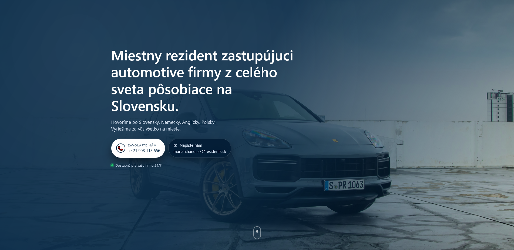
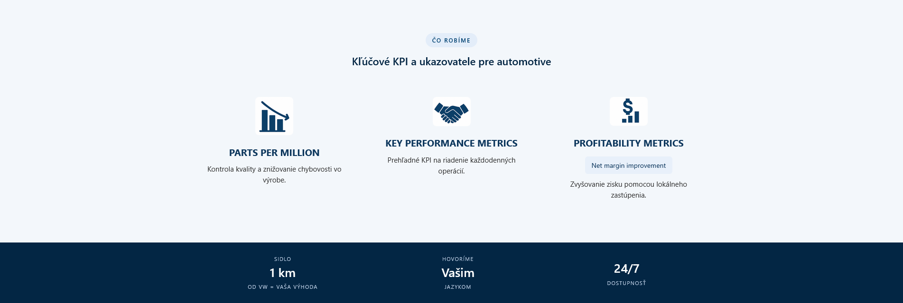
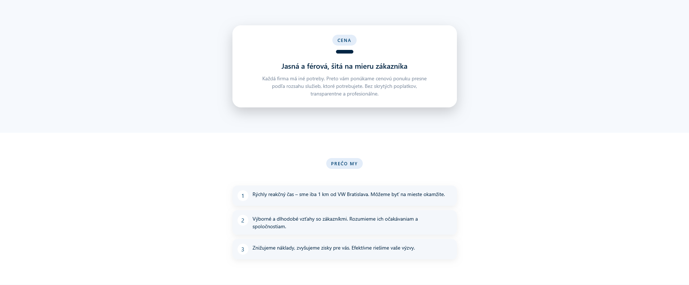
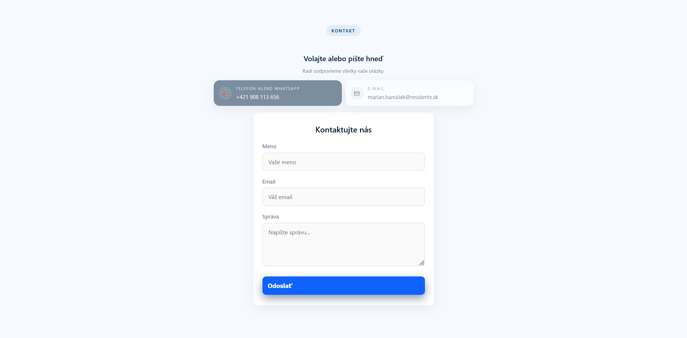

# Residents.sk

Professional landing page for a local automotive industry representative in Slovakia.

## Overview

Residents.sk is a responsive business website designed to present local representation services for international automotive companies operating in Slovakia.

The website provides information about:

- Local automotive representation services
- Key automotive KPIs and metrics
- Company benefits and availability
- Contact information
- Customer inquiry form

## Features

- Responsive design for desktop and mobile devices
- Modern landing page layout
- Contact form integration with EmailJS
- Click-to-call and email functionality
- Automotive-focused branding and presentation
- Optimized user experience for business clients

## Technologies Used

- HTML5
- CSS3
- JavaScript (Vanilla JS)
- EmailJS

## Project Structure

```
project/
│
├── index.html
├── style.css
├── email.js
│
├── data/
│   ├── logo.PNG
│   ├── 1.PNG
│   ├── 2.PNG
│   ├── 3.PNG
│   ├── m8.jpg
│   ├── porsche.png
│   └── other assets
│
└── README.md
```


## Screenshots

### Home Page



### Services Section



### Why Us



### Contact Section



## Copyright Notice

© All rights reserved.

This project is displayed exclusively as part of a professional portfolio. No permission is granted to copy, distribute, modify, reuse, or commercially exploit any part of this source code, design, images, branding, or content without prior written consent from the copyright holder.

The repository is intended solely for demonstration of software development skills.
